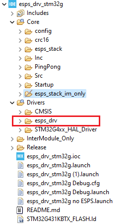

--8<-- "includes/abbreviations.md"

# Directory structure

As an example project for the integration of the ESPS I MAC Drivers, we have used a ST [NUCLEO-G431KB](https://www.st.com/en/evaluation-tools/nucleo-g431kb.html) board, that contains a [STM32G431KBT6](https://www.st.com/en/microcontrollers-microprocessors/stm32g431kb.html) microcontroller, and the [CubeIDE](https://www.st.com/en/development-tools/stm32cubeide.html) software. Some of the files are automatically generated by the CubeIDE when creating the project.

## STM32CubeIDE project structure

| Folder | Sub-folder | Description |
|---|---|---|
| :file_folder: Drivers |                     | Necessary drivers for the application to run
|       | :file_folder: esps_drv              | MAC drivers source code
|       | :file_folder: STM32G4xx_HAL_Driver  | STM32G Drivers
|       | :file_folder: CMSIS                 | Common Microcontroller Software Interface Standard for ARM
| :file_folder: Core |                        | Source code for the application
|       | :file_folder: Inc                   | Application include files
|       | :file_folder: Src                   | Application main source code
|       | :file_folder: config                | Configuration for the MAC Drivers
|       | :file_folder: Startup               | Startup file generated for the STM32G431 board
|       | :file_folder: crc16                 | CRC calculation library
|       | :file_folder: esps_stack            | [^1] ESPS I configuration dependencies
|       | :file_folder: esps_stack_im_only    | [^2] ESPS I configuration dependencies for Inter-Module communication only
|       | :file_folder: PingPong              | [^3] PingPong Function Protocol definitions
| :file_folder: Debug                 |       | Project build output
| :material-file: esps_drv_stm32g.ioc |       | Configuration file generated for the Cube IDE Project
| :material-file: STM32G431KBTX_FLASH.ld |    | Flash configuration for the Nucleo board
| :material-file: esps_drv_stm32g Debug.* |   | Debug and launch configuration for the project
| :material-file: README.md |                 | General information about the project

[^1]: The ESPS I is delivered as a static library but it needs to have some parameters set related to the application as part of its configuration.
[^2]: This is a lighter version of the ESPS I that can only be used for inter-module communication. For more information go to the [Inter-Module Only](../im_only/im_introduction.md) section.
[^3]: Endurosat ESPS I, uses the Function Protocol. PingPong, is a basic message exchange between MAC devices.

!!! note
    The files `Core/src/main.c` and `Core/inc/main.h` are part of the generated code from the CubeIDE. The files `Core/src/application.c` and `Core/inc/application.h` contain the examples of usage for sending and receiving messages with the ESPS I, using the MAC Drivers.

## CubeIDE Generated code

Some of the files are generated automatically by CubeIDE. From those files, we will modify some of them, others, we will leave as they are.

### Core folder

Most of the generated code is in the folder 'Core'. You can see here a brief description of the files:

=== "Inc"

    | File                   | Generated             | Modifications |
    |------------------------|-----------------------|---------------|
    | `application.h`        | :x:                   | N/A |
    | `main.h`               | :white_check_mark:    | None |
    | `stm32_assert.h`       | :white_check_mark:    | None |
    | `stm32g4xx_hal_conf.h` | :white_check_mark:    | None |
    | `stm32g4xx_it.h`       | :white_check_mark:    | None |

    `main.h` contains the definitions that are the labels for the different UART ports. This labels are set from the project configuration, in the .ioc file.

=== "Src"

    | File                  | Generated             | Modifications |
    |-----------------------|-----------------------|---------------|
    | `application.c`       | :x:                   | N/A |
    | `main.c`              | :white_check_mark:    | Calls to the integration code in `application.c` |
    | `stm32g4xx_hal_msp.c` | :white_check_mark:    | None |
    | `stm32g4xx_it.c`      | :white_check_mark:    | Add MAC Driver callbacks to the HW interrupt callbacks |
    | `syscalls.c`          | :white_check_mark:    | None |
    | `sysmem.c`            | :white_check_mark:    | None |
    | `system_stm32g4xx.c`  | :white_check_mark:    | None |

    `application.c` contains the main loop. It sends a couple of messages as an example and then stays in a loop to process the received messages.
    `main.c` has the main function of the project as well as important definitions for the microcontroller to work as desired.

=== "config"

    | File                      | Generated | Modifications |
    |---------------------------|-----------|---------------|
    | `esps_drv_config.c`       | :x:       | N/A |
    | `esps_drv_debug_config.c` | :x:       | N/A |
    | `esps_drv_exeh_config.c`  | :x:       | N/A |
    | `esps_drv_rng_config.c`   | :x:       | N/A |
    | `esps_drv_tim_config.c`   | :x:       | N/A |

    | File                      | Generated | Modifications |
    |---------------------------|-----------|---------------|
    | `esps_drv_config.h`       | :x:       | N/A |
    | `esps_drv_debug_config.h` | :x:       | N/A |
    | `esps_drv_def.h`          | :x:       | N/A |
    | `esps_drv_esps_stack.h`   | :x:       | N/A |
    | `esps_drv_exeh_config.h`  | :x:       | N/A |
    | `esps_drv_rng_config.h`   | :x:       | N/A |
    | `esps_drv_stm32.h`        | :x:       | N/A |
    | `esps_drv_tim_config.h`   | :x:       | N/A |

    `esps_drv_config.c` holds the initialization of the UART and the GPIOs needed for the MAC interface. It also contains functions that interface between the application and the drivers.
    `esps_drv_stm32.h` needs to include all the dependencies to the STM32 drivers necessary for the MAC to interact with the peripherals.

    !!! note
        The `config/inc` folder comes as a template with the MAC Drivers code.

=== "Startup"

    | File                     | Generated            | Modifications |
    |--------------------------|----------------------|---------------|
    | `startup_stm32g431kbtx.s`| :white_check_mark:   | None |

    Startup assembly code for the microcontroller.

=== "crc16"

    | File                          | Generated | Modifications |
    |-------------------------------|-----------|---------------|
    | `inc/crc16-ccitt.h`           | :x:       | N/A |
    | `inc/MACCRC32_Classic_Impl.h` | :x:       | N/A |
    | `src/crc16-ccitt.c`           | :x:       | N/A |
    | `src/MACCRC32_Classic_Impl.c` | :x:       | N/A |

    Helper functions for the CRC calculation.

=== "esps_stack"

    | File                                  | Generated | Modifications |
    |---------------------------------------|-----------|---------------|
    | `inc\ESPS_CommonUtils.h`              | :x:       | N/A |
    | `inc\ESPS_Stack_Facade.h`             | :x:       | N/A |
    | `inc\ESPS_Stack.h`                    | :x:       | N/A |
    | `inc\ESPS_StackConfig.h`              | :x:       | N/A |
    | `inc\ESSA_BridgeDrv.h`                | :x:       | N/A |
    | `inc\ESSA_MACTest.h`                  | :x:       | N/A |
    | `inc\ESTL_LayersLocalConf.h`          | :x:       | N/A |
    | `inc\ESTL_UserDeclarations.h`         | :x:       | N/A |
    | `src\ESPS_CommonUtils.c`              | :x:       | N/A |
    | `src\ESPS_Stack.c`                    | :x:       | N/A |
    | `src\ESPS_Stack_Facade.c`             | :x:       | N/A |
    | `lib\libESPLATFORM_NETWORK_STACK.a`   | :x:       | N/A |
    | `ES_SAT_AIRMAC`                       | :x:       | N/A |
    | `ES_SAT_API`                          | :x:       | N/A |
    | `ES_SAT_MAC`                          | :x:       | N/A |

    The ESPS I library needs some [setup](int_esps_i_stack.md).

=== "esps_stack_im_only"

    | File                                  | Generated | Modifications |
    |---------------------------------------|-----------|---------------|
    | `inc\ESPS_Stack.h`                    | :x:       | N/A |
    | `inc\ESPS_StackConfig.h`              | :x:       | N/A |
    | `inc\ESPS_Stack_Facade.h`             | :x:       | N/A |
    | `src\ESPS_CommonUtils.c`              | :x:       | N/A |
    | `src\ESPS_Stack.c`                    | :x:       | N/A |
    | `src\ESPS_Stack_Facade.c`             | :x:       | N/A |
    | `ES_SAT_MAC`                          | :x:       | N/A |

    Go to the [Inter-Module Only](../im_only/im_esps_i_stack.md) section to see how to set this up.

=== "PingPong"

    | File              | Generated | Modifications |
    |-------------------|-----------|---------------|
    | `FP_common`       | :x:       | N/A |
    | `PingPong_client` | :x:       | N/A |
    | `PingPong_server` | :x:       | N/A |

    The code in this folder is generated with another EnduroSat tool called *Macchiatto*. The only modifications done are the pahts to some of the `#include` calls.

    PingPong, is just one of the different protocols that can be used with *Macchiatto*. For more information about the configuration, go to the [FP Layer](int_function_protocol.md).

!!! important
    CubeIDE lets you generate the peripherals initialization code as well, in this example project we will not use those functions.
