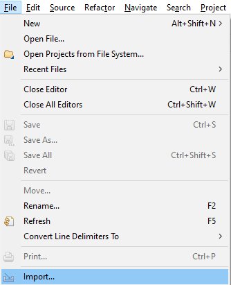
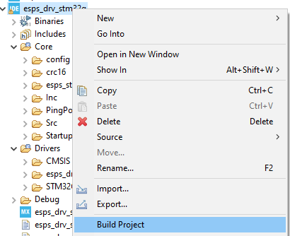

--8<-- "includes/abbreviations.md"

# Introduction

Following the information in this guide you will be able to integrate the ESPS I MAC Driver in a project using the rest of [ESPS I](int_esps_i_stack.md) stack including the [Function Protocol](int_function_protocol.md).

It is possible to integrate the drivers and only use the ESPS I Stack for Inter-Module communication. This is, send and receive messages between two modules via the RS-485 bus. You can see the specific differences in the [Inter-Module Only](../im_only/im_introduction.md) section.

!!! Important
    There are some references in the code refering to **ESSA Stack**. This is the **old nomenclature for the ESPS I**. They are equivalent.

!!! tip
    To get a better idea about how the drivers work, check the [MAC layer](../mac_layer/mac_introduction.md) page.

You should have an example project of the whole integration. Done in CubeIDE using a [NUCLEO-G431KB](https://www.st.com/en/evaluation-tools/nucleo-g431kb.html) discovery board. The configuration of the peripherals depends entirely on the device used, so it might change for the specific applicaton. Still, the [configuration for the ESPS I](int_esps_i_stack.md) network stack, is the same.

## Integration of the MAC Drivers in a project

The easiest way to proceed with the integration is to start from the example project delivered with this guide.

### Start with the example project

You would need to install the [CubeIDE](https://www.st.com/en/development-tools/stm32cubeide.html) if you don't have it already.

Once you open it, you can select the workspace folder that you desire. Then, from the tools bar, select File :material-arrow-right: Import...:

Select *General* :material-arrow-right: *Existing projects into Workspace*. And follow the instructions to select the folder where you got the example project.

Once it is imported, you should be able to build it. In the *Project Explorer*, right click on the project name and select *Build Project*:

!!! Note
    There are two build configurations: *Full_ESPS* and *InterModule_Only*. Pay attention in which one you want to use.

If it builds correctly, you should be able to run it on your device. Right click on the project name and select *Debug As* :material-arrow-right: *STM32 Cortex-M C/C++ Application*:

| Build Configuration   | Description |
|-----------------------|-------------|
| Full_ESPS             | Links the static library ESPS I and adds the necessary initializations in the ESPS I configuration code |
| InterModule_Only      | Doesn't link the static library of ESPS I and it only configures the FP protocol within the ESPS I Stack |

### Start a new project from scratch

If you prefer to start a new project, be aware of the different parts that you would need to set up:

- Create the new project (with CubeIDE or another IDE).
    - *If using CubeIDE*: Setup the configuration file (*.ioc) to describe our hardware and include the peripherals we want to use.
    - *If using another IDE*: Make sure that you have the [necessary drivers](int_configuration.md#hal-drivers) for your microcontroller.
- Add the ESPS I MAC Drivers source code to the project (delivered with this guide).
- Implement the [configuration for the drivers](int_configuration.md).
- Add the ESPS I static library (delivered as part of the example project in `esps_drv_stm32g/Core/esps_stack/lib`)
- Implement the [configuration for the ESPS I](int_esps_i_stack.md).
- Add the Function Protocol.
- Additionally, we can take advantage of the debug and exception handling mechanisms in the ESPS I MAC Drivers and [setup the necessary macros](int_debug_trace.md).

If all that is setup correctly, the project should build correctly and you would be able to start receiving and sending messages with another device.

!!! Tip
    All the configuration code can be taken from the [example project](int_dir_structure.md#stm32cubeide-project-structure), it is possible to do this and then add the necessasry includes in the project.

!!! note
    Some headers in the ESPS I MAC Drivers are in the drivers source code (`lib/esps_stack`) and in the example project. For the setup, it only need to be once, as part of the ESPS I library.
