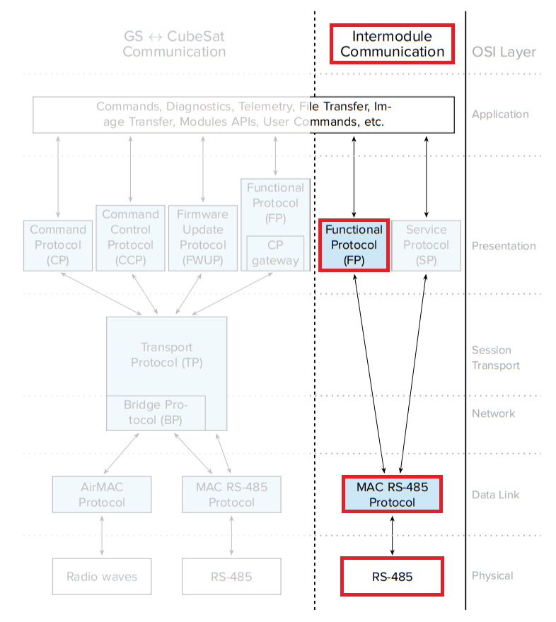

--8<-- "includes/abbreviations.md"

# Inter-module communication only

This section will cover the specific case where the ESPS I stack is only used for inter-module communication.

Every step descrbed in the integration guide is valid except for the [ESPS I](../guide/int_esps_i_stack.md) section.

## Integration of the MAC Drivers in a project

It is possible to setup the ESPS I Stack only to be used for inter-module communication. This will result in a lighter software since the rest of the protocols can be ommited, as shown in the diagram below.

### Set up the example project

To start the example project follow the same steps described in the [integration introduction](../guide/int_introduction.md#start-with-the-example-project). Just be aware that the project will need to be built with the configuration *InterModule_Only*.

This configuration has the same settings except that it doesn't try to link the ESPS I library and it uses the sources from the :file_folder: esps_stack_im_only instead of the :file_folder: esps_stack.

## Configuration of the MAC Drivers

The configuration of the MAC Drivers is exactly the same with the full stack or only with the Inter-Module configuration. You can see how to set it up in the [Integration](../guide/int_configuration.md) section.

## Configuration of the FP Protocol

The configuration of the FP for the application is the same as with the whole ESPS I stack. You can see how to do it in the [Integration](../guide/int_function_protocol.md) section.