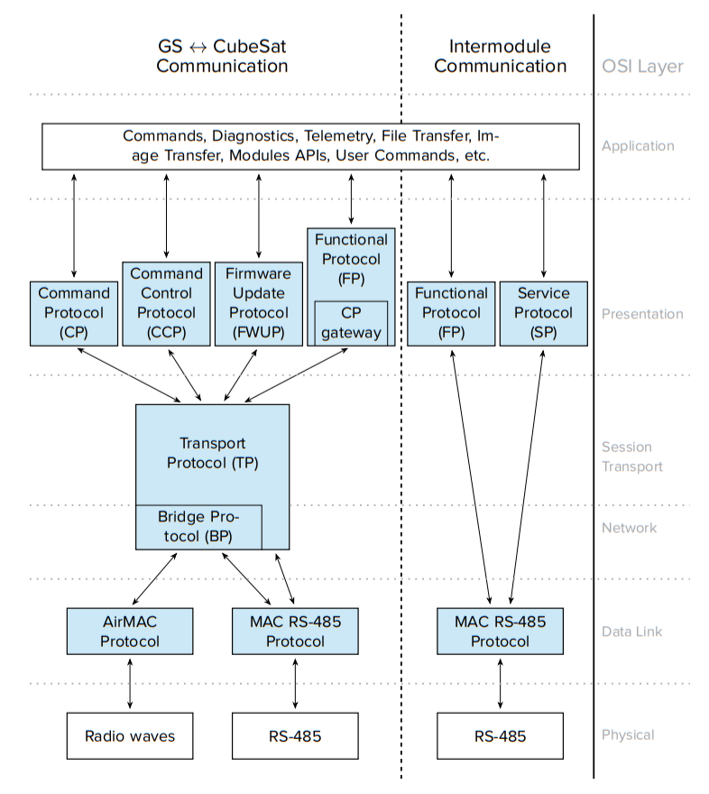

--8<-- "includes/abbreviations.md"

!!! warning "DISCLAIMER"
    INFORMATION CONTAINED IN THIS DOCUMENTATION IS CONFIDENTIAL IN NATURE AND IS SUBJECT TO THE NON-DISCLOSURE AGREEMENT BETWEEN ENDUROSAT AD AND THE INSTITUTION IT WAS SENT TO. IT IS INTENDED SOLELY FOR THE ENTITY/INSTITUTION TO WHICH IT WAS SENT PERSUANT TO THIS NDA AND SHOULD NOT BE DISSEMINATED, COPIED OR REPRODUCED FOR EXTERNAL INSTITUTIONS WITHOUT THE PRIOR CONSENT OF ENDUROSAT.

# Introduction

This guide aims to provide all the information regarding to the integration and use of the MAC layer driver, that is part of the ESPS I network stack.

For more information about the MAC layer, go to [MAC layer](mac_layer/mac_introduction.md). If you prefer to start with the integration guide, go to [Integration Guide](guide/int_introduction.md).

## What is the ESPS I?

ESPS I is a network stack protocol developed by Endurosat. It is designed to provide message exchanges between the ground station and the satellite modules.

ESPS Drivers and MAC Drivers are sinonims for the purpose of this document.

For an example of the integration of the MAC Drivers and the rest of the ESPS I stack with an application, go to the [integration](guide/int_introduction.md) section.

### ESPS I Protocols Structure

Even though, this documentation only covers the ESPS I MAC Drivers over RS-485, the drivers are part of the ESPS I stack. Just for reference, the image below is provided with the different protocols that are contained in the ESPS I stack.

## What is the MAC layer?
This layer is responsible for the final encapsulation of higher-level messages into frames, that are sent over the network to other devices using the RS-485 protocol. It is the lowest layer, from the ESPS I, that is concerned with addressing. It contains information about the sender and the destination. Each device in an ESPS I network has an unique number called MAC Address. On this layer errors that occur are handled, for example, using a CRC field.

### HW Requirements

The MAC layer is implemented on a ST Microelectronics microcontroller and it needs to have access at least to a UART port, three GPIOs, two timers and a random number generator[^1] module. For more details, go to the [HW Peripherals](mac_layer/mac_configuration.md#hardware-peripherals) section in the MAC Configuration.

[^1]: The RNG can be simulated by software as long as the functions that the drivers are expecting are defined.
