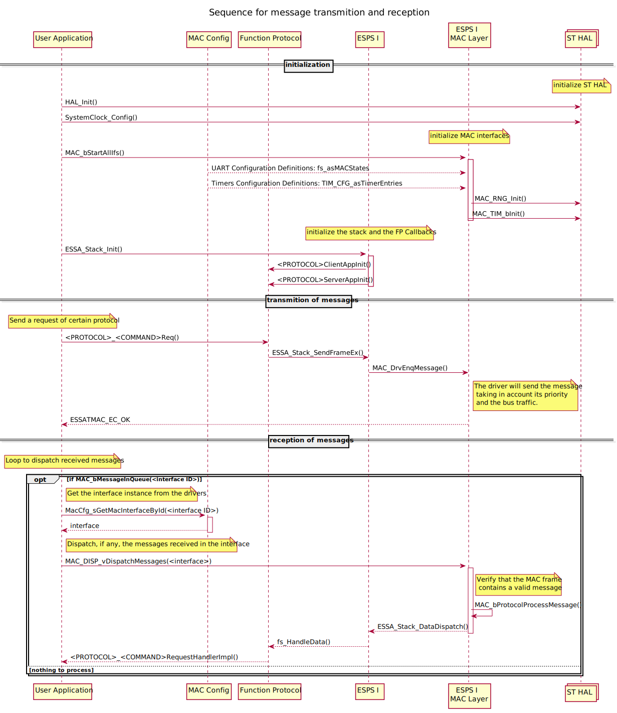

--8<-- "includes/abbreviations.md"

# Introduction

In the following section you will find the reference user manual for the MAC Drivers. If you are interested on how to implement it on a project, jump to the [Integration Guide](../guide/int_configuration.md).

Using the MAC Drivers you can **send messages over RS-485** connection between two devices. Each device needs to have a different MAC Address. And the payload is encapsulated in a MAC Frame before it is sent.

## MAC Address

Each device should have a unique address to be able to receive and send messages in the network. This address is 1 byte long. A received MAC Frame will be processed by the device if it contains one of the following addresses:

- The device address: unique for every device.
- The broadcast address: every device should answer a frame with this address.
- The device gateway address: it can be set for a sub group of devices.

!!! note
    The values for the **broadcast** and the **gateway** addresses are set in the configuration and are part of the **ESPS I network**. See more in [ESPS I](mac_configuration.md#esps-i).

## MAC Frame

The MAC Drivers encapsulate the payload that receive from the higher level layer (usually the ESPS I) in a MAC Frame. The MAC frame contains the following structure:

| Field name            | Byte offset   | Size (bytes) | Comments |
|-----------------------|---------------|--------------|----------|
| Target address        | 0             | 1            | |
| Source address        | 1             | 1            | |
| MAC Protocol ID       | 2             | 1            | |
| Data size             | 3             | 1            | |
| Header CRC (16-bit)   | 4             | 2            | CRC-CCITT-BR, LSB first |
| Data payload          | 6             | 1..255 (sz)  | |
| CRC (32-bit)          | 6 + sz        | 4            | CRC - CRC32-ISO3309, LSB first. CRC of all previously sent bytes |

### MAC Frames priority

Every message is set with certain priority level. Depending on this priority, the device will wait for a period of time with the RS-485 bus free before it sends the message. The priority levels are usually set within the ESPS Stack. For more information go to the [configuration](../guide/int_esps_i_stack.md#message-priority) section.

!!! Attention
    The MAC Frames priority is different from the **Dynamic Priority**.

## Dynamic Priority

The dynamic priority is not related to a single MAC frame but to the MAC device that is sending. Whenever it fails to send a frame because the bus is busy, the MAC device will retry to send it. It will retry as many times as defined in the `RS485_MAX_TX_RETRY_COUNT` parameter, then it will try to send the next MAC frame in the queue.

If it has been longer than `RS485_MAX_TX_WAIT_TIMEOUT` without managing to send messages, the Dynamic priority value is reduced by 1 `MAC_DEFAULT_TQ` unless it has already reached the minimum value defined for the device (`RS485_MINIMUM_PRIORITY`).

The dynamic priority value will go back to its initial value, `RS485_INITIAL_PRIORITY`, once it has managed to send a MAC frame.

!!! Note
    Higher **priority level** means that the message has to be sent before. The **priority value** is the number of TQ to wait before sending the message. So the value of the *priority value decreases when the priority level increases*.

The dynamic priority can be parametrized within the [configuration](mac_configuration.md#parameters-of-the-mac-drivers).

## MAC send and receive sequence

You can find the following structure in a typical application sending and receiving the MAC Drivers:

- **User Application**: application running in the device.
- **MAC Config**: the configurable part of the code that is not included in the MAC Drivers. It depends on the device used and it is defined as part of the application.
- **Function Protocol**: generated protocols with pre-defined commands to be sent over the ESPS I Network.
- **ESPS I**: network stack used to send Function Protocol commands between devices.
- **ESPS I MAC Layer**: drivers to send ESPS I network messages over a RS-485 connection.
- **ST HAL**: drivers from STMicroelectronics to interact with the microcontroller peripherals.

!!! Important
    In the diagram below, as well as in another sections of the documentation, you might see code refering to **ESSA Stack**. This is the **old nomenclature for the ESPS I**. They are equivalent.

