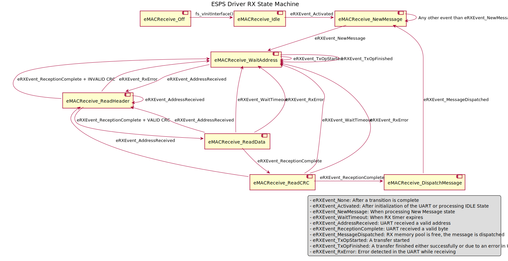
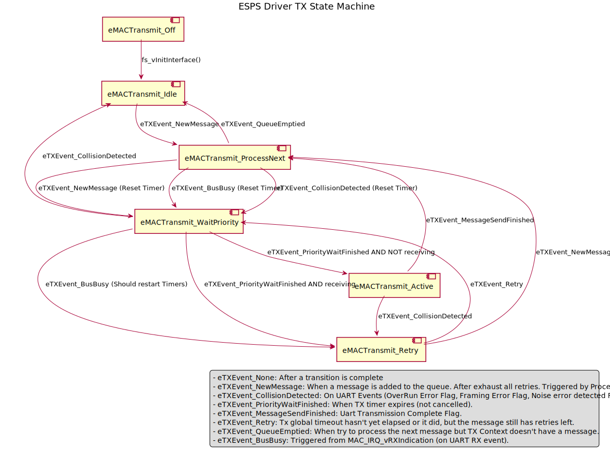

--8<-- "includes/abbreviations.md"

# Modules

Here there is an explanation about what are the role of the different modules of the MAC Drivers and what are the files related to each of them.

## MAC Driver

This is the main module of the drivers, where the logic for adding or processing messages is implemented. All the types used in the MAC Drivers are defined in these headers. As well as being the interface with the application or the ESPS I.

This module is taking care of the initialization, deinitialization, processing a received message or adding to the queue a new message to be sent.

### UART Interrupt processing

The logic for processing the traffic in the UART connection is implemented in the `esps_drv.c` and **it must be called when an UART interrupt**[^1] happens:

[^1]: The interrupt callback must be called when a HW interrupt happens which must be set up as part of the [configuration](../guide/int_configuration.md#hardware-interrupts) of the project.

```c
/**
* Treat UART interrupt events
*
* @param fp_psState - MAC interface state structure
*/
void MAC_vDispatchUARTEvent(sMACInterfaceState_t * fp_psState);
```

### Files

| Files             | Path           | Description |
|-------------------|----------------|-------------|
| `esps_drv.c`      | `esps_drv/src` | Interface definitions |
| `esps_drv.h`      | `esps_drv/inc` | Public interface declarations |
| `esps_drv_ct.h`   | `esps_drv/inc` | Private C-types definitions |
| `esps_drv_cdef.h` | `esps_drv/inc` | Common types and macro definitions |

## Dispatcher

It takes the messages from the reception queue and verifies that the CRC is valid. The MAC driver provides an interface to check whether there are messages to dispatch, `MAC_bMessageInQueue`. This method can be called to poll the interface to check for untreated messages. Alternatively, an interrupt could be set with help of the function defined in the dispatcher, `MAC_DISP_vDispatcherNotif`, that will be called once a new message is added to the reception pool.

### Files

| Files                   | Path           | Description |
|-------------------------|----------------|-------------|
| `esps_drv_dispatcher.c` | `esps_drv/src` | Logic for processing the messages in the reception pool |
| `esps_drv_dispatcher.h` | `esps_drv/inc` | Public interface declarations |

## Interrupt request

There are two modules taking care of the hardware interrupts. Basically, the reception interrupt and the transmission interrupt.

Every time there is a **reception** in the UART, an interrupt is triggered and an event is processed by a state machine. After checking the header, if the conditions are correct (CRC is ok), the driver will get the rest of the message and add it to the reception pool.

There is a state machine processing the events triggered by each interrupt:



Similarly, when a message is going to be sent, we add it to the **transmission** queue and set a timer to respect the priority. When this timer ends, an interrupt triggers an event to be processed by a state machine. If there is traffic in the bus, the message will wait and the timer will be set to wait again the priority time.



!!! Important
    The drivers will only retry to send the message (when the bus was busy) if it is set in the configuration parameters in `esps_drv_def.h`: `RS485_MAX_TX_RETRY_COUNT`.

### Files

| Files                     | Path           | Description |
|---------------------------|----------------|-------------|
| `esps_drv_receive_irq.c`  | `esps_drv/src` | Reception interrupt processing and state machine definition |
| `esps_drv_transmit_irq.c` | `esps_drv/src` | Transmition interrupt processing and state machine definition |
| `esps_drv_irq.h`          | `esps_drv/src` | Common definitions |

## Queue

The **transmission queue** keeps track of the messages to be sent that arrive from the ESPS I. It adds to the queue or pops out to be sent when the transmission timer callback is triggered. There is no queue for the reception, the received messages are processed by the state machine and store in the reception pool to be processed by the dispatcher.

### Files

| Files              | Path           | Description |
|--------------------|----------------|-------------|
| `esps_drv_queue.c` | `esps_drv/src` | Implementation to add or remove messages from the queue |
| `esps_drv_queue.h` | `esps_drv/src` | Public interface declarations |

## Pool

There are two memory pools, reception and transmission. The **transmission pool** keeps the message, the priority and the callback for the sender from the ESPS I. The **reception pool** just keeps the message.

The maximum number of RX or TX pools must be set in the configuration of the project. Typically in the file `esps_drv_def.h`:

```c
/// Count of reception memory pool entries (set to number of threads that can send MAC messages).
#define MAC_TXMEMORYPOOL_COUNT     (30U)
/// Count of transmission memory pool entries.
#define MAC_RXMEMORYPOOL_COUNT     (30U)
```

### Files

| Files             | Path           | Description |
|-------------------|----------------|-------------|
| `esps_drv_pool.c` | `esps_drv/src` | Implementation to fill in or to free a memory pool entry (reception and transmission) |
| `esps_drv_pool.h` | `esps_drv/src` | Public interface declarations |

## Debug and Exception Handling

All around the code, you can find calls to exception messages and debug messages or information. These macros are defined in the debug and exception handling module but they are meant to be overwriten by a macro **defined in the configuration**. Here is the list of macros that should be defined for the debug or the exception handling to work:

- `ESPS_CONFIG_DEBUG_ENABLE`: Allow the definition of debug macros for tracing the code.
- `ESPS_CONFIG_DEBUG_TRACE_ENABLE`: Allow the definition of `MACDRV_DBG_PRINT` used to printing debug messages.
- `MACDRV_DBG_PRINT`: Print out messages with the method given to the macro.
- `MACDRV_DBG_ASSERT`: Assert conditions in the code that, usually, will stop the execution in case of error.
- `EXEH_HANDLE_EX`: Handle an exception with the method given to the macro.
- `EXEH_CURRENT_MODULE_ID`: Defined in every module that throws exceptions.
- `EXEH_HANDLE`: Calls `EXEH_HANDLE_EX` using `EXEH_CURRENT_MODULE_ID` macro to simplify the calls in the code.

The [configuration](../guide/int_debug_trace.md) should provide this definitions. The exceptions, the severity of the exceptions and the module ids are defined in `esps_drv_exeh_ct.h`.

### Files

| Files                 | Path           | Description |
|-----------------------|----------------|-------------|
| `esps_drv_debug.h`    | `esps_drv/inc` | Debug macros default values |
| `esps_drv_exeh.h`     | `esps_drv/inc` | Exception handling macros default values |
| `esps_drv_exeh_ct.h`  | `esps_drv/inc` | Types declarations for the exception handling |

## Other

### Stats

Keep track of the bus status, and save some statistics and parameters from the network. This allows to diagnose the drivers and make sure that they are keeping up with the RS-485 requisites.

### Timers

Two timers are helping the reception and transmission of the messages. The reception timer is set to be sure we receive valid messages and to make sure we don't keep the communication bus busy unnecessarily. The transmission timer sets a value that depends on the priority of the message to give time to higher priority messages from other devices to be sent in the network.

The interrupt function that **must be called when a timer interrupt happens**, it is defined in `esps_drv_tim.c`:

```c
/**
 * IRQ handler to be called by in the compiler interrupt routine implemented
 * in the client module
 *
 * @param fp_psTimBase - pointer to Timer base register as defined in HAL LL headers
 * @param fp_eTimId   - timer identifier used to access the timer configuration in the driver
*/
void MAC_TIM_IRQ_Handler_Generic(TIM_TypeDef * fp_psTimBase, eTIMTimerID_t fp_eTimId);
```

### Random Generator

We use an array of randomly generated numbers to grant to every priority waiting period a random part. This way, it is less likely to have two devices to try to send messages at the same time, avoiding message collisions in the bus. This array is generated as part of the initialization of the drivers.

### Reset and Clock Controller

The RCC module provides an interface to start or stop the RCC peripherals from the microcontroller. Typically, is part of the initalization code.

### State machine debug

To help debugging the reception and transmission logic, when the debug flags are set, the events and states are stored in a local variable. This way, we can follow the eventes triggered with this module from an IDE, for example.

### Files

| Files                 | Path           | Description |
|-----------------------|----------------|-------------|
| `esps_drv_stats.c`    | `esps_drv/src` | Handles MAC driver run-time statistics |
| `esps_drv_stats.h`    | `esps_drv/inc` | Public interface declarations |
| `esps_drv_tim.c`      | `esps_drv/src` | Timer helper module for MAC layer |
| `esps_drv_tim.h`      | `esps_drv/inc` | Public interface declarations |
| `esps_drv_tim_ct.h`   | `esps_drv/inc` | Timer context types declarations |
| `esps_drv_rng.c`      | `esps_drv/src` | Helper functions for the MAC Driver priority timers |
| `esps_drv_rng.h`      | `esps_drv/inc` | Public interface declarations |
| `esps_drv_rcc.c`      | `esps_drv/src` | Implementation for the enable and disable functions |
| `esps_drv_rcc.h`      | `esps_drv/inc` | Public interface declarations |
| `esps_drv_sm_debug.h` | `esps_drv/inc` | Declarations for debugging the interrupt state machines |
